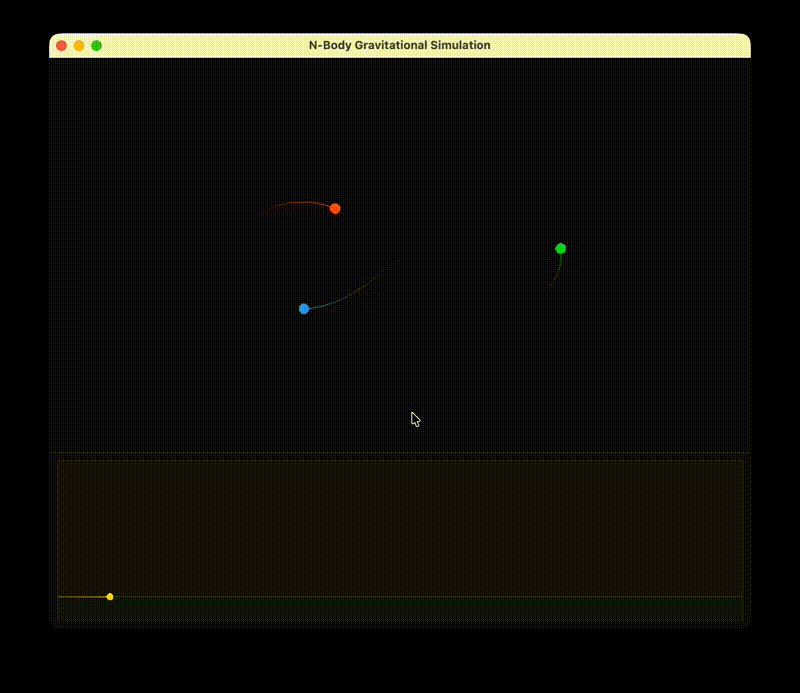

# C++ Physics Engine → N-Body Gravitational Simulation



A 2D physics engine built from scratch in C++, extended into a real-time N-body gravitational simulation with live Lyapunov exponent visualization.

---

## Part 1 — Building the Physics Engine

### Step 1: 2D Vector Math (`vec2D`)

Everything starts with a custom `vec2D` class representing a 2D vector with `float x` and `float y` components. Rather than using a library, we implemented all the math manually to understand what's happening under the hood:

- `operator+`, `operator-` — vector addition and subtraction
- `operator*` — scalar multiplication
- `operator+=`, `operator-=` — in-place versions for accumulation
- `magnitude()` — computes `sqrt(x² + y²)`
- `normalize()` — returns a unit vector in the same direction (handles zero-length case)
- `dot()` — dot product, used later for distance calculations in the Lyapunov computation

This is the foundation everything else is built on.

### Step 2: Rigid Body (`RigidBody`)

A `RigidBody` represents a physical object in 2D space. It stores:

- `position` — where the object is (vec2D)
- `velocity` — how fast and in what direction it's moving (vec2D)
- `acceleration` — current net acceleration from applied forces (vec2D)
- `mass` — how heavy it is (float)

Three methods drive the simulation:

- `applyForce(vec2D force)` — converts force to acceleration using **Newton's second law**: `a += F / m`
- `update(float dt)` — integrates forward in time using **Euler integration**: velocity updates from acceleration, then position updates from velocity
- `clearForces()` — resets acceleration to zero after each frame so forces don't accumulate across steps

This is classic OOP encapsulation — each body knows how to simulate itself, and the world just tells it what forces to apply.

### Step 3: World (`World`)

The `World` class owns a list of `RigidBody*` pointers and steps the whole simulation forward. It applies a uniform gravity vector (`vec2D(0, 9.81)` scaled by mass = gravitational force) to every body, calls `update()`, then `clearForces()`.

We used this to build the first visual demo: a bouncing ball falling under gravity, rendered with SFML.

### Step 4: Rendering with SFML

We used **SFML (Simple and Fast Multimedia Library)** for the window, event loop, and drawing. Key things used:
- `sf::RenderWindow` — creates the window
- `sf::CircleShape` — draws bodies
- `window.setFramerateLimit(60)` — caps the loop at 60fps so `dt = 0.016f` matches real time
- `sf::VertexArray` with `LineStrip` primitive — used later for drawing trails

---

## Part 2 — N-Body Gravitational Simulation

With the physics engine in place, we replaced the uniform gravity model with real pairwise gravitational attraction between bodies.

### The Physics

Newton's law of gravitation between two bodies:

```
F = G * m1 * m2 / r²
```

Direction: along the vector connecting the two bodies. By Newton's third law, the force on body i from body j is equal and opposite to the force on body j from body i — so we compute it once and apply it to both.

We added a **softening parameter** (`ε = 0.05`) in the denominator:

```
F = G * m1 * m2 / (r² + ε²)
```

This prevents the force from blowing up when two bodies get very close, which would cause numerical instability.

### `Simulation` Class

`Simulation` replaces `World` for the N-body case. Its `step()` method:

1. Divides each frame's `dt` into 100 **substeps** for numerical stability
2. For each substep, computes all pairwise gravitational forces (O(n²) pairs)
3. Applies Newton's third law symmetrically
4. Updates all bodies, then clears forces

### Initial Conditions — The Figure-8 Choreography

We use the **Chenciner & Montgomery (2000)** figure-8 solution: three equal-mass bodies chasing each other around a figure-8 curve in perfect periodic orbit. The exact initial positions and velocities that produce this orbit are:

```
Body 1: pos = (-0.97000436,  0.24308753), vel = ( 0.46620368,  0.43236573)
Body 2: pos = ( 0.97000436, -0.24308753), vel = ( 0.46620368,  0.43236573)
Body 3: pos = ( 0.00000000,  0.00000000), vel = (-0.93240737, -0.86473146)
```

These are in normalized units where `G = 1` and `m = 1`.

### Lyapunov Exponent — Quantifying Chaos

The most interesting part. The **Lyapunov exponent (λ)** measures how fast two nearby trajectories diverge — it's the mathematical definition of chaos.

**How we compute it in real time:**

1. Run a hidden **shadow simulation** alongside the main one, initialized with a tiny perturbation (`ε = 1e-6`) on one body's position
2. Every 90 frames, measure the **phase-space distance** between the two simulations — separation in both position and velocity across all bodies:
   ```
   d = sqrt( Σ |Δpos_i|² + |Δvel_i|² )
   ```
3. Accumulate: `λ_sum += log(d / ε)`
4. **Renormalize**: rescale the shadow trajectory back to distance `ε` from the main one, so we can keep measuring without the shadow flying off to infinity
5. Running estimate: `λ = λ_sum / total_time`

**What the graph tells you:**

- `λ ≈ 0` → stable, periodic orbit — the figure-8 at the start
- `λ > 0` → chaotic — nearby trajectories diverge exponentially fast

Because we use Euler integration (not a symplectic integrator), the figure-8 gradually drifts from its perfect periodic orbit over time — and you can watch `λ` climb from near-zero as the system transitions from order into chaos. This numerical drift actually makes the visualization *more* interesting: it demonstrates in real time why the three-body problem has no general closed-form solution.

---

## Building and Running

**Requirements:** SFML 3.x (`brew install sfml`)

```bash
make run
```

---

## File Structure

| File | Description |
|------|-------------|
| `vector2D.h/cpp` | 2D vector math |
| `RigidBody.h/cpp` | Physical body with Euler integration |
| `World.h/cpp` | Simple gravity world (original engine) |
| `Simulation.h/cpp` | N-body gravitational simulation with substep integration |
| `main.cpp` | SFML rendering, figure-8 initial conditions, Lyapunov computation |
