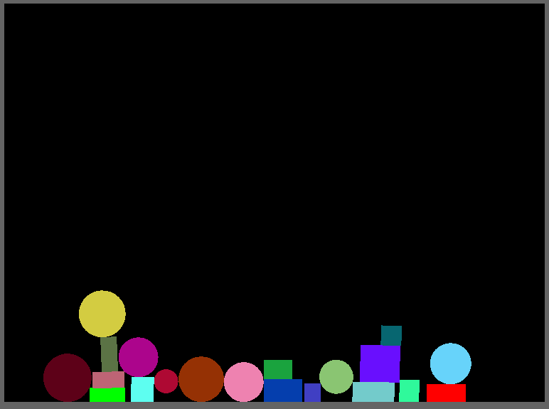

# 2D Rigid Body Physics Engine



## A simple 2D rigid body physics engine written entirely in C++ capable of simulating interactions between objects.

This project was created for educational purposes, and is greatly inspired by the YouTube series by Two-Bit Coding for a physics engine in C. Therefore, there are similar concepts and logic that I adapted in order to complete this project.

## Features
* A core physics engine
* Contact points detection (commented out)
* Vectors visualization for velocities and forces (commented out in the code)
* An interactive renderer for testing with object spawning


---


## Architecture and limitations
*Due to limited resources, this project can only cover a certain amount of crucial factors of a physics engine:*

* **Collision Detection:** Separating Axis Theorem (SAT) is used for overlap detection for oriented bounding boxes and circles.
* **Sutherland-Hodgman Clipping:** To generate accurate multi-point contact manifolds and independent penetration depths.
* **Sequential Impulses:** Solves complex multi-body interactions iteratively. This approach may hinder a more accurate and precise simulation of system with multiple objects and/or sensitive to changes. 
*Note: The engine uses a "cold-starting" approach (intra-frame accumulators rather than cross-frame caching). Because of this, simulating massive multi-object systems may require higher iteration counts to maintain precision and stack stability.*
* **Friction & Damping:** Calculates dynamic and static friction as a 2D cross-product, accurately accounting for torque and normal force constraints. It also includes basic velocity damping to simulate air resistance and prevent continuous floating-point drift.
* **Custom parameters:** These includes overlapping and reactionary force percentage that can be adjusted to the liking of the users. They will help the user to tweak the engine in case the logic itself has some minor flaws.


---


## Dependencies
* C++11 or higher
* [SFML](https://www.sfml-dev.org/)

## Building and Running

```bash
make run
```

---

### Critical Versioning Note: SFML 2 vs SFML 3
This project strictly requires all users to agree on a specific major version of SFML to avoid compilation errors. 

There are massive changes between SFML 2 and SFML 3, specifically regarding how modern C++ features are utilized in the rendering loop. SFML 3 code is **NOT** backward compatible with SFML 2 compilers.

As an example, the event polling architectures completely diverge:

**SFML 3 (Modernized `std::optional` approach):**
```cpp
while (const std::optional event = window.pollEvent()) {
    if (event->is<sf::Event::Closed>()) {
        window.close();
    }
}
```

**SFML 2 (Standard reference approach):**
```cpp
sf::Event event;
while (window.pollEvent(event)) {
    if (event.type == sf::Event::Closed) {
        window.close();
    }
}
```


If you are developing on Linux, package managers like apt often default to distributing SFML 2.6. If the repository is currently targeting SFML 3, Linux users must build SFML 3 from source via CMake to prevent architecture mismatch conflicts.

*Note: At the time this engine was written, Linux was only supporting SFML 2, hence, if you are using any different OS or want a newer version of SFML feel free to change*


---

## Installing SFML
### Linux
```bash
sudo apt-get update
sudo apt-get install libsfml-dev
```

### MacOS
```bash
brew install sfml
```

---

## File Structure

| File | Description |
|------|-------------|
| `vector2D.h/cpp` | 2D vector math |
| `RigidBody.h/cpp` | Physical body properties with Euler integration |
| `shape.h/circle.h/box.h` | Geometric definitions and vertex data for the collision shapes |
| `collision.h` | Collision detection (SAT) and Sutherland-Hodgman clipping for multi-point contact manifolds |
| `World.h/cpp` | Core physics pipeline (Gravity integration, manifold generation, impulse solver) |
| `main.cpp` | SFML rendering, interactive object spawner, testbed scenario configuration |